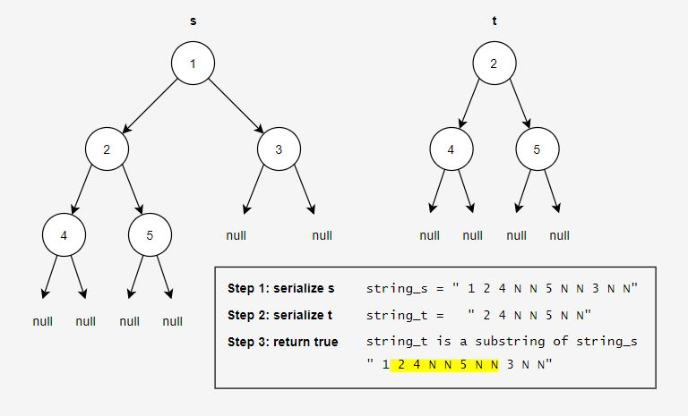

<!-- MathJax -->

<!------------------------------------------------------------------------------------------------------------------------------------->

# Subtree of Another Tree 

<!------------------------------------------------------------------------------------------------------------------------------------->

## Approach 1: Brute Force ⭐

For every node in the bigger tree s, we want to check if it is the same tree as the smaller tree t. We use recursion to accomplish this:
- If the current node in s is equal to the smaller tree t, return true
- Otherwise, recursively check if the current node's left child contains t as a subtree, and then if the current node's right child contains t as a subtree

<iframe src="https://leetcode.com/playground/YxKD2YGD/shared" frameBorder="0" width="100%" height="255"></iframe>

Note that in the `isSameTree()` method, we can replace the first two lines of code with `if (s == null || t == null) return s == t;`  
For more details or alternate implementations of `isSameTree()`, check out my explanation of LeetCode problem [Same Tree](../0100_Same-Tree/Explanation.md).

### Complexity Analysis

Let m = number of nodes in s  
Let n = number of nodes in t

<b>Time: \(O(mn)\)</b>

  In the worst case scenario, there are many duplicate values in s and t and we must check every node in t for every node in s.

<b>Space: \(O(m)\)</b>

  Each recursive call takes up a stack frame and the worst case scenario occurs when s is skewed. Imagine we are \(m-x\) recursive calls
  deep into <code>isSubtree()</code> when <code>isSameTree()</code> is called. It takes at most \(x+1\) recursive calls of
  <code>isSameTree()</code> to reach a null child in s and verify that the current node is not t. Therefore, we will never use more than
  \(m+1\) stack frames.

<!--
### Optimization Ideas:
- level order traversal (instead of preorder) in isSubtree asdasdasd average runtime
- calculate height of t, store nodes in s with that height in a set, only run isSameTree on those nodes, increases worst case runtime, but not asymptotically
- asdasd Morris Traversal in issametree and issubtree (constant space) -->

<!------------------------------------------------------------------------------------------------------------------------------------->

## Approach 2: Reduction to Substring Problem (String, indexOf) ⭐
Another approach to this problem is to reduce it to the substring problem first. The algorithm for this approach consists of 3 steps:
1. Serialize s - traverse the bigger tree s and store the order of the traversal in `string_s`
2. Serialize t - traverse the smaller tree t and store the order of the traversal in `string_t`
3. Return whether or not `string_t` is a substring of `string_s`

Things to note:
- When we serialize a tree, we will use "N" to represent a null child.
- When we serialize a tree, we will use a space " " as a delimiter in the strings to separate node values.
- When we serialize a tree, we will traverse the nodes using a [preorder traversal](). If an [inorder traversal]() or a [postorder traversal]() is used instead, we would need to differentiate between left null children and right null children.
- When checking whether `string_t` is a substring of `string_s`, we will use Java's built in library function `indexOf()`, which returns the index of the first occurrence of `string_t` in `string_s`, and -1 otherwise.

Here is an example of the algorithm:

Below is the full solution:
<iframe src="https://leetcode.com/playground/YfqkE2mS/shared" frameBorder="0" width="100%" height="255"></iframe>

### Complexity Analysis

Let m = number of nodes in s  
Let n = number of nodes in t

<b>Time: \(O(m^2+n^2+mn)\)</b>

  With the code above, serializing s takes \(O(m^2)\) time. This is because String objects are immutable in Java. Therefore, when we
  append to the string m times, we are actually creating m new strings, each with length \(O(m)\). Initializing a string of length 
  \(O(m)\) takes \(O(m)\) time, so initializing m strings of length \(O(m)\) takes \(O(m^2 )\) time. This same reasoning is why
  serializing t takes \(O(n^2)\) time. Lastly, the Java library function <code>indexOf()</code> takes \(O(mn)\) time. This is because it
  uses a simple brute force substring algorithm.

<b>Space: \(O(m^2+n^2)\)</b>

  Again, because strings are immutable in Java, we will end up creating m strings of length \(O(m)\) and n strings of length \(O(n)\).
  This will require \(O(m^2)\) and \(O(n^2)\) space respectively. In addition, serializing s and t require \(O(m)\) and \(O(n)\) stack
  frames, but this is negligible compared to the space required to store the strings.

<!------------------------------------------------------------------------------------------------------------------------------------->

## Approach 3: Reduction to Substring Problem (StringBuilder, indexOf) ⭐
Using immutable strings was the primary cause of the previous approach's bad time and space complexity. So let us use something mutable  like StringBuilder or StringBuffer instead.

<iframe src="https://leetcode.com/playground/kVgVLyNW/shared" frameBorder="0" width="100%" height="290"></iframe>

### Complexity Analysis

Let m = number of nodes in s  
Let n = number of nodes in t

<b>Time: \(O(mn)\)</b>

  The limiting factor of the runtime for this algorithm comes from the Java library function <code>indexOf()</code>, which takes
  \(O(mn)\) time. Serializing s and t now only take \(O(m)\) and \(O(n)\) time respectively.

<b>Space: \(O(m+n)\)</b>

  We need \(O(m)\) space to store one StringBuilder and one String of length m, and we need \(O(n)\) space to store one StringBuilder
  and one String of length n. In addition, serializing s and t require \(O(m)\) and \(O(n)\) stack frames respectively.

<!------------------------------------------------------------------------------------------------------------------------------------->

## Approach 4: Reduction to Substring Problem (StringBuilder, KMP) ⭐⭐
We can improve the asymptotic runtime of the previous approach even further by using a [linear time pattern searching algorithm]() instead of the library function `indexOf()`. I have chosen to use [KMP]() as my linear time substring algorithm below:

<iframe></iframe>

Note that typically KMP finds all occurrences of a substring in a string, but I have modified it to return true as soon as it finds one occurrence.

### Complexity Analysis

Let m = number of nodes in s  
Let n = number of nodes in t

<b>Time: \(O(m+n)\)</b>

  

<b>Space: \(O(m+n)\)</b>

  

### Optimization Ideas:
- asdasd Morris Traversal

<!------------------------------------------------------------------------------------------------------------------------------------->

## Approach 5: HashSet

<iframe></iframe>

#### Complexity Analysis
Let m = number of nodes in s  
Let n = number of nodes in t

<b>Time: \(O(m^2)\)</b>

  

<b>Space: \(O(m^2)\)</b>

  

<!------------------------------------------------------------------------------------------------------------------------------------->
